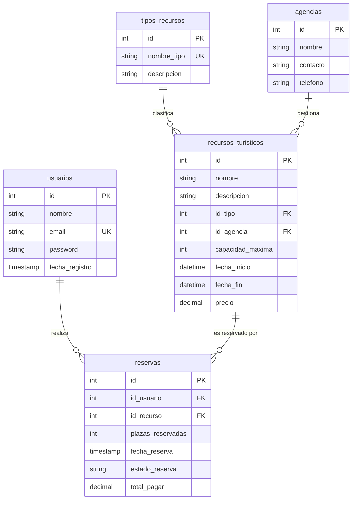

# Documentación del Módulo de Servidor (PHP y MySQL/MariaDB)

Este documento detalla la estructura, normalización y el diseño de la base de datos utilizada para la central de reservas de recursos turísticos en la aplicación **Las Palmas Desktop**.

---

## 1. Diagrama Entidad-Relación (E-R)

A continuación se muestra el diagrama E-R con las relaciones y claves principales/foráneas del sistema de base de datos:

---

## 2. Descripción de las Tablas y Normalización

La base de datos consta de **5 tablas** relacionadas y normalizadas hasta la **Tercera Forma Normal (3FN)**:

### 2.1. Tabla `usuarios`
Almacena los datos personales e identificativos de los usuarios de la plataforma que pueden reservar recursos.
*   **id** (`INT`, PK, Auto-increment): Identificador único del usuario.
*   **nombre** (`VARCHAR(100)`): Nombre completo.
*   **email** (`VARCHAR(100)`, UNIQUE): Correo electrónico único para iniciar sesión.
*   **password** (`VARCHAR(255)`): Contraseña encriptada de forma segura mediante `password_hash()` con algoritmo `BCRYPT`.
*   **fecha_registro** (`TIMESTAMP`): Fecha y hora en la que se registró el usuario.

### 2.2. Tabla `agencias`
Registra las agencias gestoras de las diferentes actividades y servicios turísticos. Evita redundancia de información en la tabla de recursos.
*   **id** (`INT`, PK, Auto-increment): Identificador de la agencia.
*   **nombre** (`VARCHAR(100)`): Nombre de la entidad (ej. Cabildo de Gran Canaria).
*   **contacto** (`VARCHAR(100)`): Nombre del responsable de contacto.
*   **telefono** (`VARCHAR(20)`): Teléfono de contacto.

### 2.3. Tabla `tipos_recursos`
Almacena las distintas categorías de recursos turísticos (museos, rutas, restaurantes, hoteles, etc.).
*   **id** (`INT`, PK, Auto-increment): Identificador de la categoría.
*   **nombre_tipo** (`VARCHAR(50)`, UNIQUE): Nombre de la categoría.
*   **descripcion** (`TEXT`): Explicación del tipo de actividades englobadas.

### 2.4. Tabla `recursos_turisticos`
Contiene la información detallada de cada recurso turístico disponible para reserva.
*   **id** (`INT`, PK, Auto-increment): Identificador único del recurso.
*   **nombre** (`VARCHAR(150)`): Nombre del recurso.
*   **descripcion** (`TEXT`): Resumen de la actividad o servicio.
*   **id_tipo** (`INT`, FK ref `tipos_recursos.id`): Categoría del recurso.
*   **id_agencia** (`INT`, FK ref `agencias.id`): Agencia que gestiona el recurso.
*   **capacidad_maxima** (`INT`): Aforo o plazas máximas disponibles en total.
*   **fecha_inicio** (`DATETIME`): Momento de inicio de la actividad o estancia.
*   **fecha_fin** (`DATETIME`): Momento de finalización.
*   **precio** (`DECIMAL(10,2)`): Coste unitario por plaza reservada.

### 2.5. Tabla `reservas`
Registra las reservas confirmadas y anuladas de los usuarios sobre los recursos.
*   **id** (`INT`, PK, Auto-increment): Identificador de la reserva.
*   **id_usuario** (`INT`, FK ref `usuarios.id`): Usuario que realiza la reserva.
*   **id_recurso** (`INT`, FK ref `recursos_turisticos.id`): Recurso reservado.
*   **plazas_reservadas** (`INT`): Cantidad de plazas adquiridas.
*   **fecha_reserva** (`TIMESTAMP`): Fecha en la que se generó la reserva.
*   **estado_reserva** (`VARCHAR(50)`): Estado de la reserva ('confirmada' o 'anulada').
*   **total_pagar** (`DECIMAL(10,2)`): Importe total calculado (`plazas_reservadas * recurso.precio`).

---

## 3. Características de Implementación en PHP

*   **Paradigma de Orientación a Objetos**: Se han encapsulado las conexiones y operaciones en clases PHP independientes:
    *   `Database.php`: Crea la conexión PDO, la base de datos, las tablas y las inicializa.
    *   `Usuario.php`: Registra y autentica al usuario.
    *   `RecursoTuristico.php`: Administra la consulta de recursos y cálculo de aforo libre.
    *   `Reserva.php`: Administra la creación, consulta y anulación de las reservas de un usuario.
*   **Instalación Inteligente (Zero-Config)**: La clase `Database.php` comprueba de forma automática si las tablas de la base de datos existen al cargar la página `reservas.php`. Si no existen, ejecuta el archivo `crear_db.sql` e importa los datos iniciales de los 5 archivos `.csv` incluidos en el directorio `php/`.
*   **Sin dependencias externas**: Se ha programado utilizando código nativo (Vanilla PHP, PDO y CSS puro).
